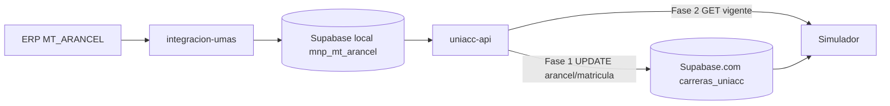

# Arancel ERP → Simulador Implementation Plan

> **For agentic workers:** REQUIRED SUB-SKILL: Use superpowers:subagent-driven-development (recommended) or superpowers:executing-plans to implement this plan task-by-task. Steps use checkbox (`- [ ]`) syntax for tracking.

**Goal:** Que el simulador use arancel/matrícula desde `MT_ARANCEL` (vigente + Periodo máximo) sin carga manual, respetando que el ETL y el BaaS del simulador son bases distintas.

**Architecture:** `integracion-umas` sigue cargando el histórico en Supabase **local**. `uniacc-api` es el puente: lee `mnp_mt_arancel` local, aplica la regla de negocio y (1) expone un endpoint y/o (2) actualiza `carreras_uniacc` en Supabase **cloud**. El simulador no habla con el ERP ni con el Postgres local.

**Tech Stack:** ETL Python (`integracion-umas-docker`), Express/TS (`uniacc-api-docker`), Vue/Supabase JS (`simulador-becas-docker`), Postgres local `:54322`, Supabase.com `carreras_uniacc`.

**Copia espejo:** también en `simulador-becas-docker/docs/superpowers/plans/2026-08-10-arancel-erp-simulador.md`.

## Global Constraints

- ETL destino = Supabase autohospedado local (`:54322`) — **no** supabase.com.
- Simulador = BaaS supabase.com (`VITE_SUPABASE_*` → proyecto cloud).
- Jornada: `D` / `V` / `S` / `AD`.
- Mapeo modalidad → jornada: Presencial/Diurno → `D`, Vespertino → `V`, Semipresencial → `S`, Online / a Distancia → `AD`.
- **`categoria_alumno = 1`** (ingreso normal de estudiante; único valor para el simulador).
- Resolución: filtrar cat=1 → vigentes hoy → `periodo` MAX → **`monto` MAX** (arancel lista); si no hay vigentes → `fec_ter_vig` DESC, luego `periodo` MAX, luego `monto` MAX.
- No meter la regla de vigencia en el ETL (carga fiel al ERP).
- No consultar MSSQL desde el browser.

---

## Contexto: el gap de datos

```text
ERP MT_ARANCEL
    → integracion-umas (diario)
    → Supabase LOCAL  public.mnp_mt_arancel     ✅ ya existe
                                                      ❌ el simulador NO ve esto

Simulador
    → Supabase CLOUD  public.carreras_uniacc   (arancel/matricula manual hoy)
```

Hay que **puentear** local → cloud (o local → API → front). El ETL solo no alcanza.

---

## Decisión de diseño

**Fase 1 (rápida, poco cambio en front):**  
Job/endpoint en `uniacc-api` que resuelve arancel por cada fila de `carreras_uniacc` (cloud) con `codigo_carrera` + jornada mapeada desde `modalidad_programa`, y hace `UPDATE` de `arancel` / `matricula` en cloud.

**Fase 2 (opcional):**  
`POST/GET /api/simulador/arancel/vigente` — el simulador consulta al elegir carrera.

Empezar por **Fase 1**.

---

## Archivos involucrados

| Repo | Archivos | Rol |
|------|----------|-----|
| `integracion-umas-docker` | `SQL/mt_arancel.sql`, `config/extracts.yaml`, migration `mnp_mt_arancel` | Ya OK; validar/ajustar si falta año o índice |
| `uniacc-api-docker` | nuevo service + controller + route; env cloud | Resolver + push a cloud / endpoint |
| `simulador-becas-docker` | mapeo jornada; opcional call API | Consumo |
| Supabase **cloud** | (opcional) columnas `jornada`, `arancel_synced_at` | Trazabilidad |

---

## Diagrama objetivo



---

## Task 1 — Validar datos en local y cloud

- [x] Confirmar filas en local: `mnp_mt_arancel` para `ADPU1AR` y otras.
- [x] Contrastar con query ERP de ejemplo (ADPU1AR 2026).
- [x] Listar en cloud `carreras_uniacc`: `codigo_carrera` y distribución de `modalidad_programa`.
- [x] Documentar overlap código×jornada entre cloud y `mnp_mt_arancel`.

**Done when:** Hay evidencia de overlap código×jornada entre cloud y `mnp_mt_arancel`. ✅

---

## Task 2 — SQL de resolución (reutilizable)

- [x] Escribir query/función: cat=1 → vigentes → `periodo` DESC, `monto` DESC; fallback `fec_ter_vig` DESC, `periodo` DESC, `monto` DESC.
- [x] Casos de prueba: ADPU1AR+AD hoy → Periodo 2 / monto **2.510.000**; fecha fuera de vigencia → fallback.

**Implementado en:** `src/services/simulador-arancel-resolver.service.ts` + `POST /api/simulador/arancel/vigente`.

```sql
WITH base AS (
  SELECT *
  FROM public.mnp_mt_arancel
  WHERE cod_carrera = $1
    AND jornada = $2
    AND categoria_alumno = 1   -- ingreso normal
),
vigentes AS (
  SELECT * FROM base
  WHERE fec_ini_vig::date <= $3::date AND fec_ter_vig::date >= $3::date
)
SELECT * FROM vigentes
ORDER BY periodo DESC NULLS LAST, monto DESC NULLS LAST
LIMIT 1;
-- si vacío:
-- SELECT * FROM base
-- ORDER BY fec_ter_vig DESC NULLS LAST, periodo DESC NULLS LAST, monto DESC NULLS LAST
-- LIMIT 1;
```

### Hallazgos Task 1 (2026-08-10)

- Local `mnp_mt_arancel`: **782** filas; jornadas D/AD/S/V presentes.
- Cloud `carreras_uniacc`: **93** carreras; **35** con `codigo_carrera`; **58** sin código (no syncables hasta completar código).
- Modalidades cloud con código: Diurno 19, Online 9, Semipresencial 4, Vespertino 3.
- Overlap OK p.ej. `ADPU1AR`+AD, `PSIC1DR`+D, `ARQU1DR`+D, `DERE1VR`+V, `PERI1SR`+S.
- ADPU1AR Online en cloud ya tiene arancel **2.510.000** / matrícula **250.000** (alineado al “lista” Periodo 2 cat=1).

**Done when:** Query validada a mano en local para 2–3 carreras. ✅

---

## Task 3 — `uniacc-api`: resolver + sync a cloud (Fase 1)

- [x] Env nuevo (sin mezclar con `SUPABASE_PG_*` local), p.ej. `SIMULADOR_SUPABASE_URL` + `SIMULADOR_SUPABASE_SERVICE_ROLE`.
- [x] Service `simulador-arancel-sync.service.ts` (+ endpoint `POST /api/simulador/aranceles/sync`).
- [x] Completar `SIMULADOR_SUPABASE_SERVICE_ROLE` en `.env` (service role del proyecto cloud del simulador).
- [x] Ejecutar dry-run y sync real; verificar ADPU1AR en cloud.
- [ ] Documentar cadena: tras ETL → llamar este sync.

**Done when:** Tras sync, una carrera de prueba en cloud tiene montos ERP correctos. ✅ (2026-08-10: 22 updated, 13 unchanged, 58 sin código; ADPU1AR 2.510.000 OK)

---

## Task 4 — Endpoint on-demand (Fase 2)

- [x] `POST /api/simulador/arancel/vigente` body `{ codCarr, jornada?, modalidad?, fecha? }`.
- [x] Si viene `modalidad`, mapear a jornada en el service.
- [x] Respuesta: `{ monto, matricula, periodo, vigente, fec_ini_vig, fec_ter_vig }`.

**Done when:** curl contra API devuelve Periodo 2 para ADPU1AR+AD. ✅

---

## Task 5 — Simulador

**Opción A (con Task 3):** sin cambio de cálculo; verificar UI tras sync cloud.

- [x] Verificar en `simulador-dev.uniacc.cl` que el store `carreras` carga aranceles syncados (2026-08-10).
  - ADPU1AR Online → **2.510.000** / matrícula 250.000
  - DACO1DR Diurno → **4.440.000**
  - DERE1VR Vespertino → **3.810.000**
  - MUCO1DR Diurno → **6.420.000**

**Opción B (con Task 4):** pendiente (call API on-demand; no necesario si Fase 1 basta).

**Done when:** Simulación de prueba muestra arancel ERP sin editar a mano. ✅ (datos en store del SPA OK)

---

## Task 6 — integracion-umas (solo si hace falta)

- [x] Revisar `WHERE ANO >= 2026` (documentado; revisar al cambiar de año).
- [x] Índice `(cod_carrera, jornada)` — migration `20260810150000_mnp_mt_arancel_codcarr_jornada_idx.sql` (aplicado en local).
- [x] **No** cambiar destino a supabase.com desde el ETL.
- [x] Documentar en README + `docs/arancel-simulador.md`: post-sync → uniacc-api.

**Done when:** Doc + extract alineados; sin segundo destino en el ETL. ✅

---

## Task 7 — Operación y verificación

- [x] Flujo diario documentado: cron ETL 04:00 → sync cloud (`docs/simulador-arancel-ops.md`).
- [x] Checklist: 3+ carreras (D, AD, S, V) cloud vs ERP.
- [x] Helper `scripts/sync-simulador-aranceles.sh` (imprime updated/skipped/notFound).
- [x] (Opcional futuro) encadenar sync cloud automáticamente tras el cron ETL. ✅ 2026-08-10
  - `run_sync_cron.sh` → `trigger_simulador_arancel_sync.sh`
  - También tras `POST /api/rematricula/aranceles/sync`

**Done when:** Ops documentada y smoke dry-run OK. ✅

---

## Orden de ejecución

1. Task 1–2 (datos + query)
2. Task 3 (puente cloud) ← mayor impacto
3. Task 5A verificación
4. Task 4 + 5B si montos en tiempo real
5. Task 6–7 ops

## Fuera de alcance

- Migrar el simulador al Supabase local.
- Hacer que `integracion-umas` escriba directo a supabase.com.
- Unificar `matricula-net` (rematrícula / SP) con este flujo.
