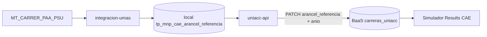

# CAE arancel referencia ERP → Simulador BaaS Implementation Plan

> **For agentic workers:** REQUIRED SUB-SKILL: Use superpowers:subagent-driven-development (recommended) or superpowers:executing-plans to implement this plan task-by-task. Steps use checkbox (`- [ ]`) syntax for tracking.

**Goal:** Actualizar en supabase.com (`carreras_uniacc.arancel_referencia` / `anio_arancel_referencia`) el arancel de referencia CAE desde el extract ERP `MT_CARRER_PAA_PSU`, sin que el simulador lea el Supabase local.

**Architecture:** Reutilizar el patrón del sync de aranceles: ETL ya carga `tp_mnp_cae_arancel_referencia` en local; `uniacc-api` resuelve fila por carrera y hace PATCH al BaaS. Encadenar tras ETL diario y tras `POST /api/rematricula/cae-arancel-referencia/sync`.

**Tech Stack:** `integracion-umas-docker` (ETL), Express/TS (`uniacc-api-docker`), Vue/Supabase JS (`simulador-becas-docker`), Postgres local `:54322`, Supabase.com `carreras_uniacc`.

**Copia espejo:** `simulador-becas-docker/docs/superpowers/plans/2026-08-10-cae-arancel-referencia-simulador.md`.

**Referencia de patrón:** plan aranceles `2026-08-10-arancel-erp-simulador.md` + services `simulador-arancel-*.service.ts`.

## Global Constraints

- ETL destino = Supabase **local** (`tp_mnp_cae_arancel_referencia`) — **no** supabase.com.
- Simulador lee BaaS: `carreras_uniacc.arancel_referencia` + `anio_arancel_referencia` (Results.vue).
- Tabla legacy BaaS `aranceles_cae` queda **fuera de alcance** (el front no la usa para el cálculo CAE actual).
- Extract `SQL/mt_carrer_paa_psu.sql` **no trae jornada** → match solo por `codigo_carrera` (texto ERP, ej. `ADPU1AR`).
- Resolución de fila CAE: `arancel_referencia > 0` obligatorio. Preferir `ano` = año sysdate; si no hay (ceros = no cargado en ERP), **año − 1**; dentro: `periodo` MAX → `arancel_referencia` MAX.
- Si no hay filas en año actual ni siguiente: fallback `ano` DESC, luego `periodo` DESC, luego `arancel_referencia` DESC.
- Reutilizar `SIMULADOR_SUPABASE_URL` + `SIMULADOR_SUPABASE_SERVICE_ROLE` (ya en uniacc-api).
- No consultar MSSQL desde el browser.

---

## Contexto: gap de datos

```text
ERP MT_CARRER_PAA_PSU
    → integracion-umas (diario + POST rematricula/cae-arancel-referencia/sync)
    → LOCAL  public.tp_mnp_cae_arancel_referencia   ✅ ya existe
                                                      ❌ el simulador NO ve esto

Simulador
    → CLOUD  carreras_uniacc.arancel_referencia     (manual / desactualizado)
             carreras_uniacc.anio_arancel_referencia
```

Campo ERP clave: `Arancel_referencia` → columna local `arancel_referencia`.

---

## Decisión de diseño

**Misma Fase 1 que aranceles:** sync batch que UPDATE columnas en `carreras_uniacc`.

No hace falta endpoint on-demand en el front (el cálculo CAE ya lee de la carrera cargada).

Encadenamiento:

1. Tras ETL diario (`run_sync_cron.sh`) — tras (o junto a) el trigger de aranceles.
2. Tras `caeArancelReferenciaSyncService.syncFromErp()` exitoso — igual que `aranceles-sync` empuja simulador.

---

## Archivos a crear / modificar

| Repo | Archivo | Rol |
|------|---------|-----|
| `uniacc-api-docker` | `src/services/simulador-cae-arancel-resolver.service.ts` | SQL resolución local |
| `uniacc-api-docker` | `src/services/simulador-cae-arancel-sync.service.ts` | PATCH cloud |
| `uniacc-api-docker` | `src/controllers/simulador-arancel.controller.ts` (o nuevo) | Handler HTTP |
| `uniacc-api-docker` | `src/routes/simulador.routes.ts` | `POST .../cae-arancel-referencia/sync` |
| `uniacc-api-docker` | `src/services/cae-arancel-referencia-sync.service.ts` | Encadenar push BaaS |
| `uniacc-api-docker` | `scripts/sync-simulador-cae-arancel.sh` | Helper ops |
| `uniacc-api-docker` | `docs/simulador-arancel-ops.md` | Documentar CAE |
| `integracion-umas-docker` | `scripts/trigger_simulador_cae_arancel_sync.sh` | Curl post-ETL |
| `integracion-umas-docker` | `scripts/run_sync_cron.sh` | Llamar trigger CAE |
| `integracion-umas-docker` | `docs/arancel-simulador.md` (o `cae-simulador.md`) | Cadena documentada |
| `integracion-umas-docker` | SQL extract | **Sin cambio** (ya OK) |

---

## Diagrama



---

## Task 1 — Validar datos local vs cloud

- [x] Contar filas en `tp_mnp_cae_arancel_referencia` (local).
- [x] Sample por `cod_carrera` (ej. ADPU1AR): `ano`, `periodo`, `arancel_referencia`.
- [x] Listar en cloud `carreras_uniacc` con `codigo_carrera` y valores actuales de `arancel_referencia` / `anio_arancel_referencia`.
- [x] Confirmar overlap de códigos.

**Done when:** Hay al menos 1 carrera con código en ambos lados y valor ERP distinto o igual documentado.

**Nota:** exigir `arancel_referencia > 0` (P2 con 0 no debe ganar por `periodo` MAX). Si el año completo está en 0 → usar año anterior.

---

## Task 2 — Resolver SQL (local)

- [x] Implementar `resolverCaeArancelReferencia({ codCarr, anio? })`:
  - Base: `WHERE UPPER(TRIM(cod_carrera)) = $1` y `arancel_referencia > 0`
  - Candidatos: preferir `ano = year` si existe alguna fila > 0; si no, `ano = year - 1`
  - Orden: `periodo DESC`, `arancel_referencia DESC`
  - Fallback global si no hay año actual/anterior: `ORDER BY ano DESC, periodo DESC, arancel_referencia DESC LIMIT 1`
- [x] Retornar `{ codCarrera, ano, periodo, arancelReferencia }`
- [x] Caso de prueba manual: ADPU1AR → 2026 P1 = 2.510.000

**Done when:** Query/service devuelve fila esperada para 2–3 códigos.

---

## Task 3 — Sync cloud (uniacc-api)

- [x] `syncCaeArancelReferenciaCarrerasCloud({ dryRun? })`:
  1. GET cloud `carreras_uniacc?select=id,codigo_carrera,arancel_referencia,anio_arancel_referencia`
  2. Por cada una con código → resolver local
  3. Si cambia → PATCH `{ arancel_referencia, anio_arancel_referencia }`
  4. Stats: updated / unchanged / skipped_no_codigo / not_found
- [x] `POST /api/simulador/cae-arancel-referencia/sync` body `{ dryRun?: boolean }`
- [x] Reusar env `SIMULADOR_SUPABASE_*`

**Done when:** dry-run + sync real actualizan al menos una carrera de prueba en BaaS.

---

## Task 4 — Encadenar

- [x] Tras éxito en `caeArancelReferenciaSyncService.syncFromErp()` → llamar sync BaaS (no tumbar ETL si falla push).
- [x] Script `trigger_simulador_cae_arancel_sync.sh` + llamada desde `run_sync_cron.sh` (después del trigger de aranceles).
- [x] Env opcional `SIMULADOR_CAE_ARANCEL_SYNC_ENABLED` / `SIMULADOR_CAE_ARANCEL_SYNC_URL` (default `http://uniacc-api:3001/api/simulador/cae-arancel-referencia/sync`).

**Done when:** curl desde contenedor ETL al endpoint responde 200; documentado cómo apagar.

---

## Task 5 — Verificar simulador

- [x] Tras sync, en UI Results con CAE: monto de referencia = valor ERP para la carrera elegida (BaaS ADPU1AR = 2510000).
- [x] Si `anio_arancel_referencia < ANIO_POSTULACION`, el asterisco/aviso existente sigue coherente (sin cambio de front).

**Done when:** Spot-check 2 carreras (ej. Online + Diurno) en BaaS y en UI.

---

## Task 6 — Docs / ops

- [x] Actualizar `docs/simulador-arancel-ops.md` (sección CAE).
- [x] Actualizar `integracion-umas` docs (cadena post-ETL incluye CAE).
- [x] Helper `./scripts/sync-simulador-cae-arancel.sh [--dry-run]`.

**Done when:** Ops reproducible sin leer este plan.

---

## Orden de ejecución

1. Task 1–2 (datos + resolver)
2. Task 3 (sync + endpoint)
3. Task 4 (cadena)
4. Task 5–6 (UI + docs)

## Fuera de alcance

- Migrar o sincronizar tabla BaaS `aranceles_cae`.
- Añadir jornada al extract `MT_CARRER_PAA_PSU`.
- Cambiar lógica de cálculo CAE en el front (solo datos).
- Filtrar extract `WHERE ANO >= 2024` (dejar como está salvo que ops pida subir a 2026).
